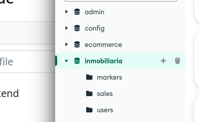
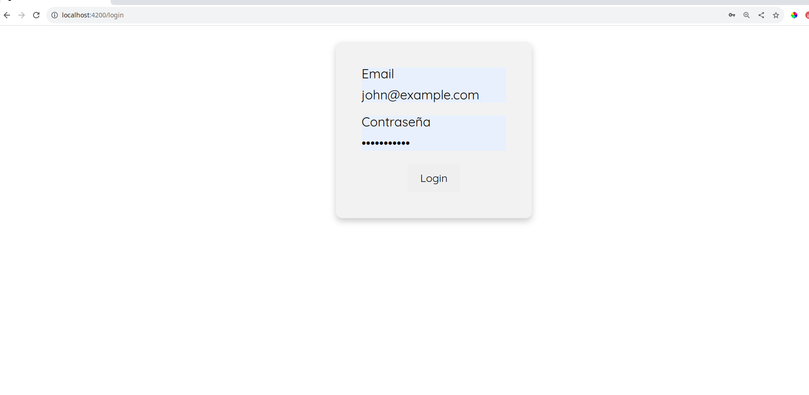
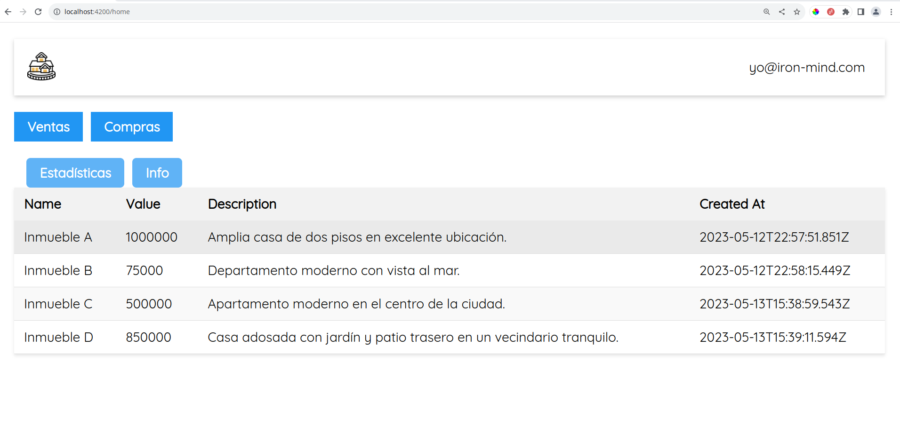
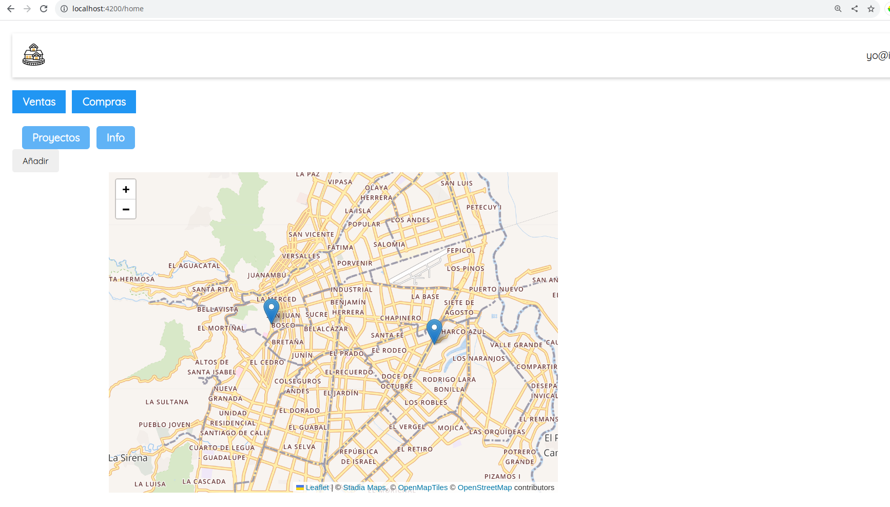
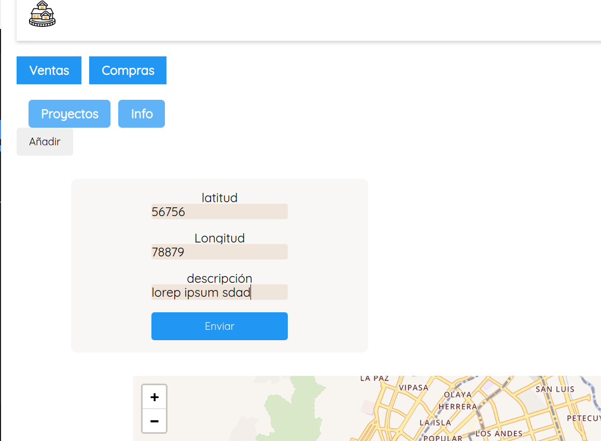

# inmobiliaria_app

## requerimientos
- Tener el puerto configurado: En la carpeta backend hay archivo .env que no oculté para facilitar ejecución

- Una base de datos mongodb llamada inmobiliaria. NO es necesario crear las colecciones. Ya se crearan cuando ejecute el backend. Despues de ejecutar el backend puede añadir la data de los archivos .json que hay en la carpeta principal.

<!-- insertar imagen -->
   

# Ejecución
- Ejecutar el backend:  en la carpeta backend (correrá en el puerto 3003)
```
npm run start
```

- Ejecutar el frontend:  en la carpeta frontend (correrá en el puerto 4200)

```
npm run start
```


# Como debe verse
## Login
   
## Estadísticas
  
## Mapa 
  
## Formulario 
   


